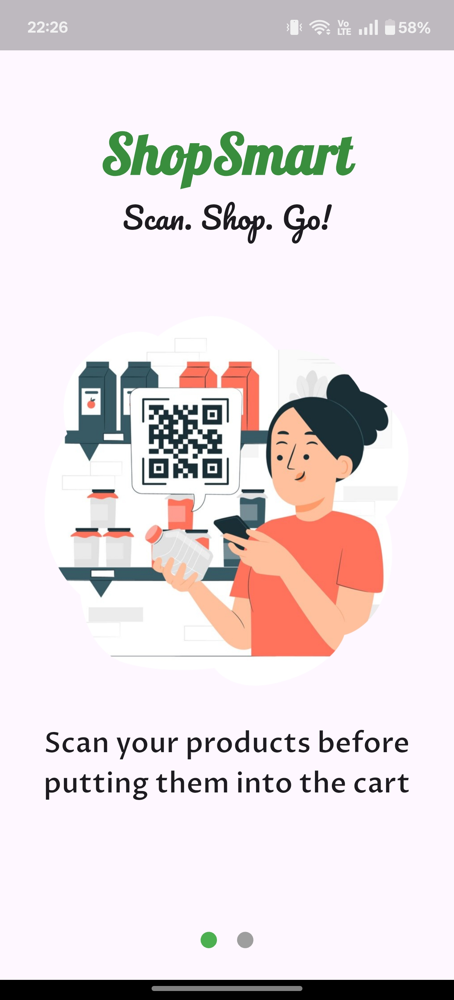
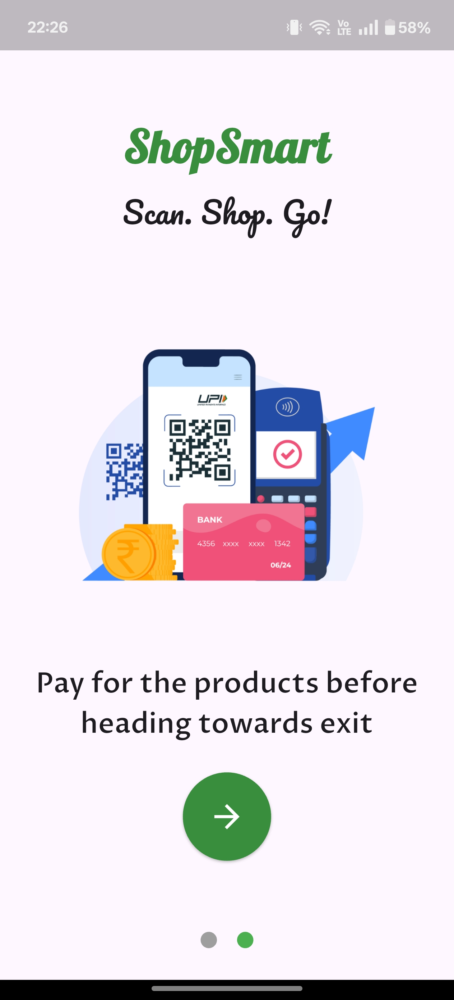
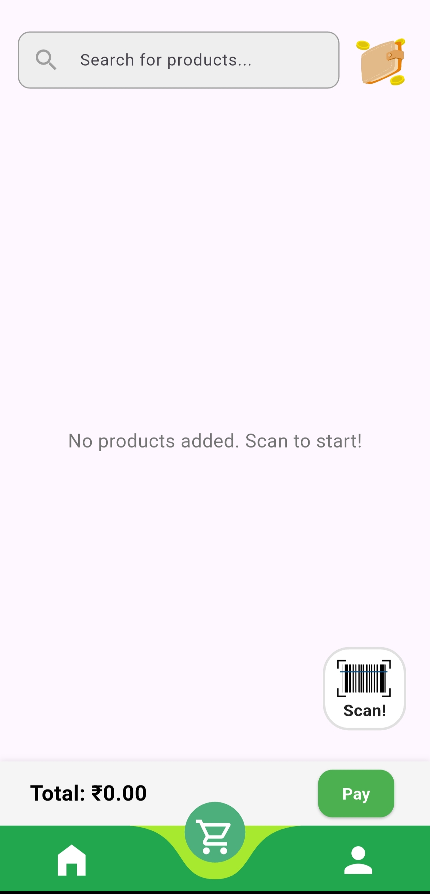
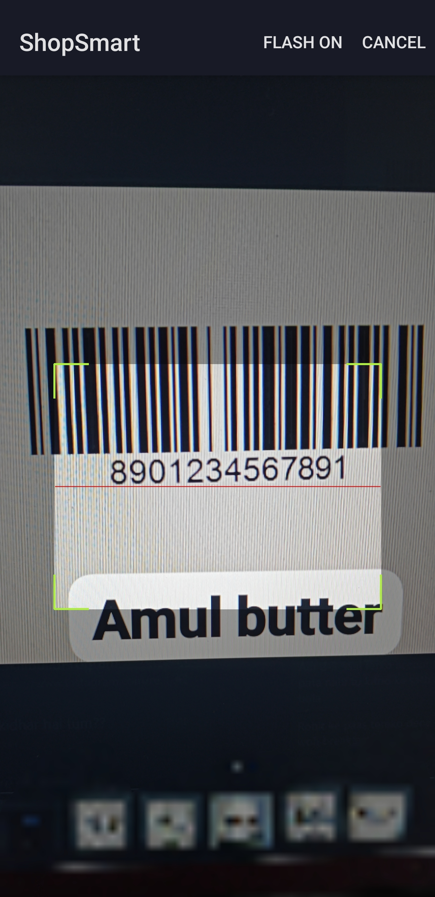
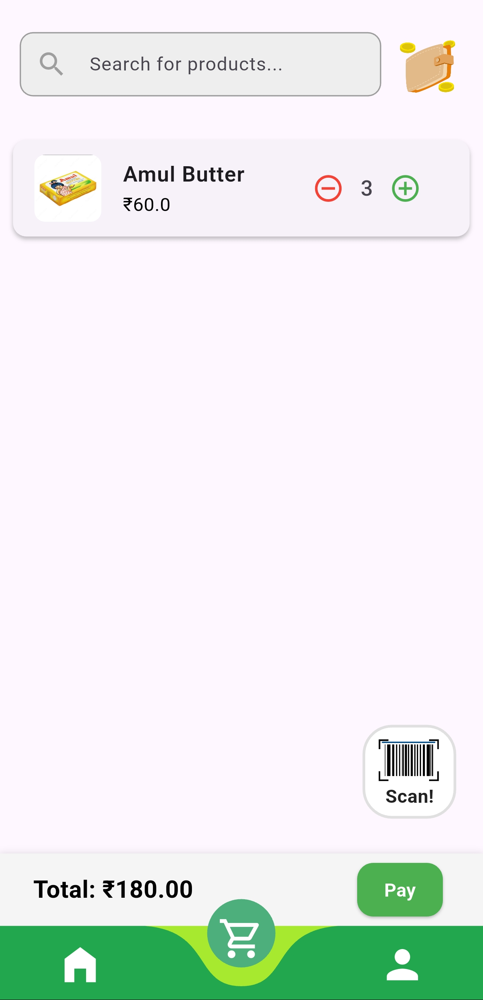
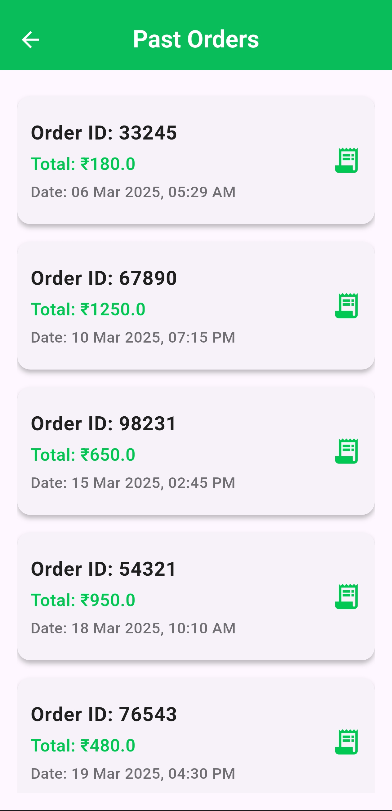
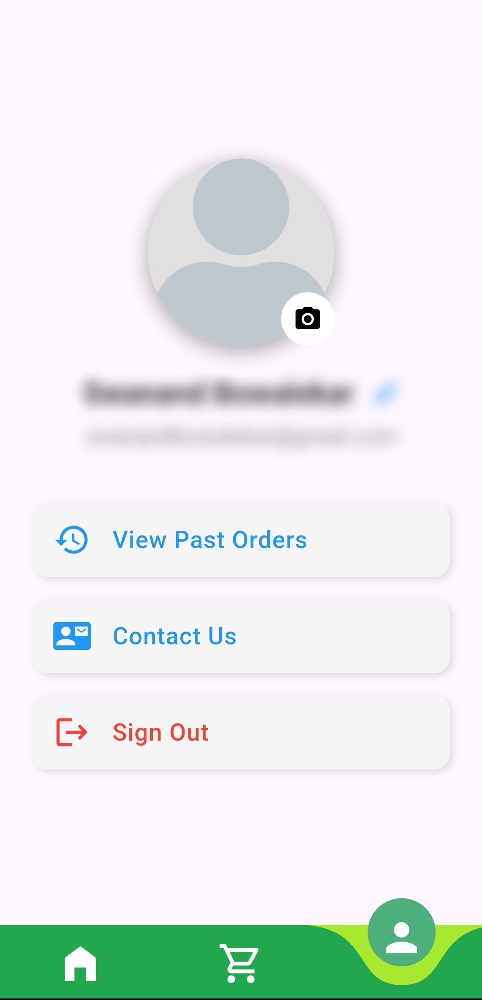
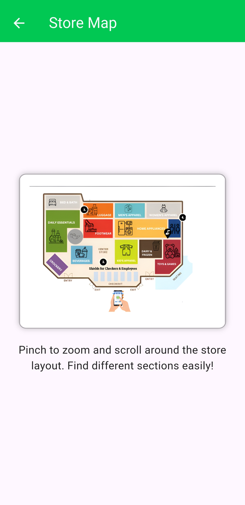

# ShopSmart 🛒

ShopSmart is a smart shopping cart application built using Flutter. It allows users to scan product barcodes or QR codes, add items to their cart, and streamline the checkout process.

## Features 🚀
- 📷 **QR Code & Barcode Scanner**: Scan product barcodes and QR codes to add items to the cart.
- 🛍️ **Seamless Shopping Experience**: Keeps track of scanned items in a virtual cart.
- 🔄 **Persistent Cart Data**: Cart items remain even when switching pages.
- ☁ **Firebase Authentication**: Supports Google Sign-In.
- 🎨 **Responsive UI**: Uses `flutter_screenutil` for dynamic UI scaling.

## Tech Stack 🏗️
- **Frontend**: Flutter (Dart)
- **Backend**: Firebase

## Installation & Setup 🛠️
1. **Clone the repository:**
   ```sh
   git clone https://github.com/NotSwanand/ShopSmart.git
   cd ShopSmart
   ```
2. **Install dependencies:**
   ```sh
   flutter pub get
   ```
3. **Run the app:**
   ```sh
   flutter run
   ```

## How It Works? 🤖
1. Open the app and sign in using Google authentication.
2. Scan a product's QR code or barcode.
3. The product details (name, image, price) are added to the cart.
4. View the cart and proceed to checkout.

## Folder Structure 📁
```
ShopSmart/
│-- lib/
│   │-- main.dart         # Entry point of the app
│   │-- screens/          # UI screens
│   │-- models/           # Data models
│   │-- services/         # Backend & Firebase functions
│   └-- utils/            # Helper functions
│-- assets/               # Images & icons
│-- pubspec.yaml          # Dependencies
│-- README.md             # Project documentation
```

## 📸 Screenshots  

### 🚀 Start Pages  
| Start Page 1 | Start Page 2 | Start Page 3 |
|--------------|--------------|--------------|
|  |  |  |

### 🏠 Home Page  
  

### 🛍️ Empty Cart Page  
 

### 🔍 Scanning Page  
  

### 🛒 Added Cart Page  
  

### 📦 Past Orders Page  
  

### 👤 Profile Page  
  

### 📍 Store Map  
  

## Contributions 🤝
Feel free to contribute by submitting a pull request or reporting issues!

## License 📜
This project is licensed under the MIT License.

---

Happy Shopping! 🛍️
